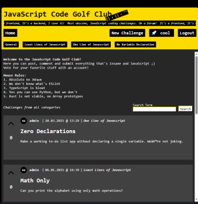

# Code Golf Club - HY tikawe project
> This repository contains University of Helsinki CS course work. Contents in Finnish.

**Nykytilanne**



- Käyttäjä voi luoda tilin, kirjautua, luoda haasteita, muokata haasteita, poistaa haasteita ja äänestää haasteita.
- Käyttäjä voi kommentoida haasteita, sekä muokata ja poistaa omia kommenttejaan.
- Lisäksi käyttäjä voi katsella toisten profiileja ja katsella sekä muokata omaa profiiliaan.
- Käyttäjä voi selata haasteita jostain tietystä tai kaikista kategorioista ja etsiä haasteita hakusanalla.
- Käyttäjä voi hakea profiileja hakusanalla
- Hakutulokset ja haastelistaukset on jaettu sivuihin.
- Käyttäjä voi vaihtaa oman salasanasa
- Admin tilillä voi muokata kaikkien julkaisemaa sisältöä
- Admin tilillä voi muokata toisten tilien profiileja
- Admin tilillä voi vaihtaa toisten tilien salasanoja
- Admin tilillä voi edellyttää toista tiliä vaihtamaan salasansa kirjautuessa

Projektirakenne on suht. locked-in ja komponentteja on jaettu eri tiedostoihin koodikannan kasvun seurauksena.

### Sovelluksen toiminnot
- [X] Käyttäjä pystyy luomaan tunnuksen ja kirjautumaan sisään sovellukseen.
- [X] Käyttäjä voi luoda ja muokata omaa profiiliaan (kuvaus, profiilikuva ja taustakuva)
- [X] Käyttäjä näkee äänestystilastoja profiilistaan
- [X] Käyttäjä pystyy lisäämään, muokkaamaan ja poistamaan haasteita.
- Käyttäjä pystyy lisäämään liitteitä haasteisiin
- [X] Käyttäjä näkee sovellukseen itse ja toisten käyttäjien toimesta julkaistut haasteet
- [X] Käyttäjä pystyy etsimään haasteita hakusanalla
- [X] Käyttäjä pystyy etsimään profiileja hakusanalla
- [X] Käyttäjä voi äänestää haasteita
- [X] Käyttäjä voi luoda, muokata ja poistaa kommentteja
- [X] Käyttäjä voi luoda, muokata ja poistaa ratkaisuja
- [X] Käyttäjä voi äänestää ratkaisuja
- [X] Käyttäjä voi äänestää kommentteja


### Sovelluksen käyttö
- Sovelluksen ainut riippuvuus on `flask`.
- Sovellus edellyttää Python version `>=3.8`.
- Tietokanta alustuu automaattisesti.

#### Projektiympäristö (vaihtoehtoinen)
Luo virtuaaliympäristö:

```bash
$ python3 -m venv venv
$ source venv/bin/activate
```

#### Asenna riippuvuudet
`requirements.txt` sisältää `flask`-kirjaston lisäksi `python-dotnev`-kirjaston, joka mahdollistaa `flask run` komennon toimivuuden repositorion juuressa.

**[!]** Kirjasto `python-dotenv` ei ole itse sovelluksen riippuvuus, joten sen asentaminen on vapaaehtoista!

```bash
$ pip install -r requirements.txt
```

#### Suorita sovellus
Mikäli `python-dotenv` saatavilla:

```bash
$ flask run
```

Muussa tapauksessa:

```bash
$ flask --app ./src/app.py run --debug
```

### Suunnitelma
Forum/kilpailu-sivusto, jossa käyttäjät voivat luoda ja osallistua code-golf haasteisiin.

Perinteisen code golfin sijaan sivulla on kategoriat:
- Least Lines of Javascript
- One Line of Javascript
- No Variable Declaration

- Etusivu
    - Haasteita ja vastauksia voi selata avoimesti, mutta oman ratkaisun lähetys vaatii rekisteröitymisen ja kirjautumisen.

- Haasteiden luonti
    - Vain kirjautuneet käyttäjät voivat luoda uusia haasteita.
    - Kirjautuneet käyttäjät voivat jättää haasteisiin myös kommentteja vastauksen sijaan
    - Kirjautuneet käyttäjät voivat poistaa/muokata vastauksia ja kommenttejaan

- Äänestäminen
    - Kirjautuneet käyttäjät voivat äänestää upvote/downvote metodilla ratkaisuja ja haasteita

- Profiilit
    - Rekisteröityessään käyttäjä luo itselleen profiilin
    - Kirjautunut käyttäjä voi muokata omaa profiiliaan
    - Rekisteröityessä valittu käyttäjänimi on muuttumaton ja uniikki
    - Muokattavia tietoja ovat lempinimi, kuvaus, profiilikuva ja profiilibanner
    - Profiilista näkyy kaikki käyttäjän haasteet, vastaukset ja kommentit
    - Profiilista näkyy käyttäjän saamien äänien summa
